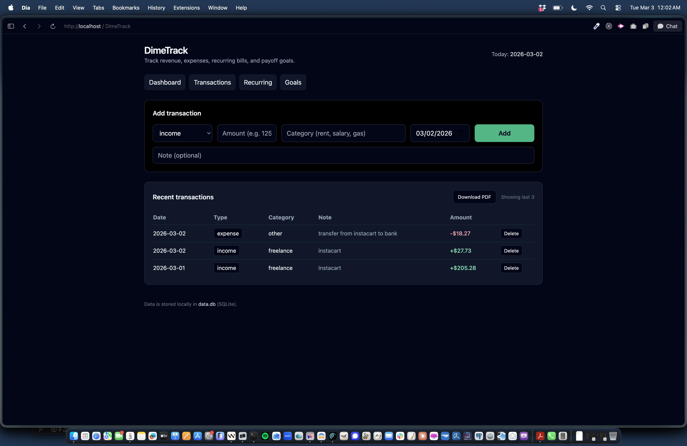
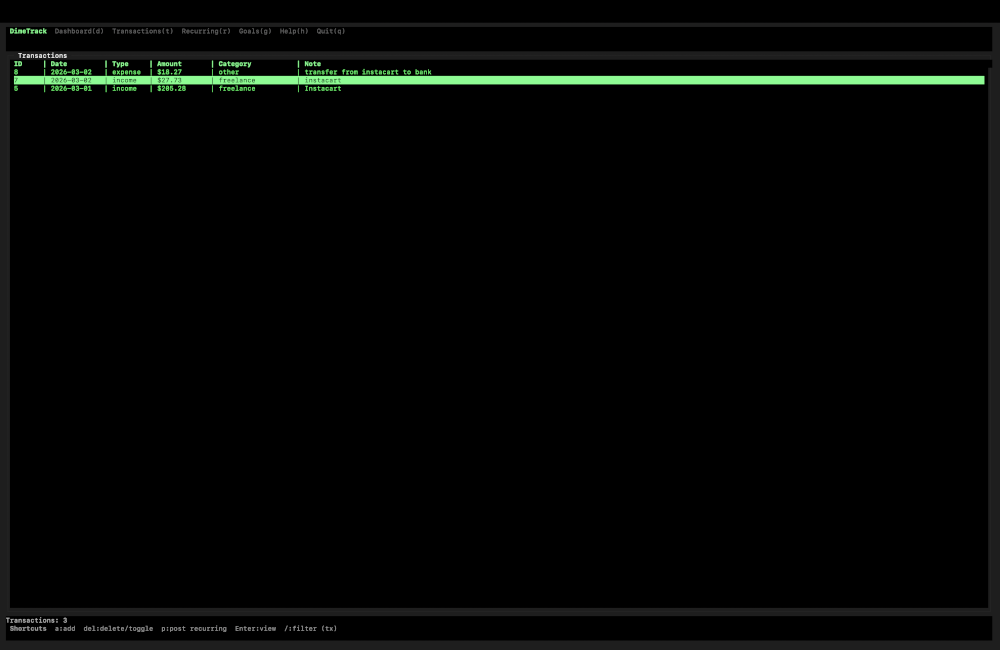

# DimeTrack

Local-first revenue + expense tracker built with Node.js, Express, and SQLite.

DimeTrack is intentionally simple: your data lives in a local SQLite database (`data.db`) and you can manage it through a web UI, a terminal UI (TUI), or a CLI. Both interfaces share the same database and have full feature parity.

## Features

- **Transactions**: track income and expenses with category, note, and date. Color-coded by type with search and date-range filtering.
- **Recurring items**: rent, subscriptions, paychecks — auto-post overdue items on startup. Urgency badges show overdue/upcoming status.
- **Goals**: savings goals with visual progress bars, completion badges, and overall progress tracking.
- **Budgets**: monthly spending limits per category with progress bars, OVER/WARN/OK status alerts, and summary stats.
- **Trips & Mileage**: odometer-based trip tracking with auto gas cost estimation, net profitability, cost/profit per mile, and IRS mileage deduction calculation (2025 rate: $0.70/mi).
- **Dashboard**: at-a-glance monthly overview with income/expense bars, goal progress, upcoming recurring, budget alerts, and trip profitability.
- **CSV export**: export any section (transactions, recurring, goals, budgets, trips) to CSV via `/export/{section}.csv`.
- **PDF reports**: export transactions as a PDF with optional date range.
- **Multiple interfaces**:
  - **Web UI** (Express + EJS + Tailwind CSS) — summary cards, progress bars, status badges, color-coded tables
  - **TUI** (Blessed) — Unicode progress bars, spark bars, summary banners, color-coded rows, context-aware shortcuts
  - **CLI** — scripting and quick checks

## Screens / Interfaces

| View         | Web UI                                       | TUI                                       |
| ------------ | -------------------------------------------- | ----------------------------------------- |
| Dashboard    | Summary cards, budget alerts, trip stats     | Spark bars, progress bars, color sections |
| Transactions | Color-coded table, CSV/PDF export            | Income/expense spark bar summary          |
| Recurring    | Urgency badges, monthly/weekly totals        | Active/paused/overdue counts              |
| Goals        | Progress bars, completion glow, stats        | Overall progress bar, done/active counts  |
| Budgets      | Card layout, OVER/WARN/OK badges             | Progress bars, spending summary           |
| Trips        | 5-stat cards, profitability banner, IRS info | Cost/profit per mile, verdict             |

## Screenshots

### Web UI



### Terminal UI (TUI)



## Quickstart

### Requirements

- Node.js (LTS recommended)

### Install

```bash
npm install
```

### Run the web app

```bash
npm start
```

Then open:

- http://localhost:3000

### Run the TUI

```bash
npm run tui
```

**TUI keyboard shortcuts:**

| Key                     | Action                                                                  |
| ----------------------- | ----------------------------------------------------------------------- |
| `d` `t` `r` `g` `b` `m` | Switch view (Dashboard, Transactions, Recurring, Goals, Budgets, Trips) |
| `a`                     | Add new item                                                            |
| `Enter`                 | Edit selected item                                                      |
| `Del`                   | Delete / toggle                                                         |
| `/`                     | Search / filter                                                         |
| `f`                     | Date range filter (transactions)                                        |
| `v`                     | Vehicle settings (trips)                                                |
| `e`                     | Export to CSV                                                           |
| `p`                     | Post recurring item                                                     |
| `Tab` / `Shift+Tab`     | Cycle views                                                             |
| `h` / `?`               | Help                                                                    |
| `q`                     | Quit                                                                    |

### Run the CLI

```bash
npm run cli
```

## CSV Export

Export any section to CSV from the web UI:

- `/export/transactions.csv`
- `/export/recurring.csv`
- `/export/goals.csv`
- `/export/budgets.csv`
- `/export/trips.csv`

Each view also has an "Export CSV" button in the web interface.

## PDF Reports

Download a transactions report PDF:

- `GET /reports/transactions.pdf`

Optional date-range parameters:

- `/reports/transactions.pdf?start=YYYY-MM-DD&end=YYYY-MM-DD`

If `start`/`end` aren't provided, the report defaults to the current month.

## Vehicle & Trip Settings

DimeTrack estimates gas costs automatically using your vehicle settings:

- **MPG**: your vehicle's fuel efficiency
- **Gas price**: current price per gallon

These can be updated in the Trips view (web or TUI). When logging a trip, leave the gas cost blank to auto-estimate from odometer readings. The IRS standard mileage rate ($0.70/mile for 2025) is used to calculate tax deductions.

## Data & Storage

- The SQLite database lives at `data.db` in the project directory.
- Both the web UI and TUI read/write the same database — changes in one are immediately visible in the other.
- This repo's `.gitignore` ignores `*.db` so your personal data doesn't get committed.

## Project Structure

- `server.js` — Express web app (routes + rendering)
- `db.js` — SQLite schema + shared DB helpers
- `views/` — EJS templates (dashboard, transactions, recurring, goals, budgets, trips)
- `views/partials/` — shared layout (top/bottom with nav)
- `tui.js` — terminal UI (Blessed)
- `cli.js` — command-line interface

## Roadmap

- Better category management UI
- Automated tests
- Charts and trend visualizations
- Multi-month budget history
- Receipt attachment support

## Contributing

Contributions are welcome — especially:

- Bug fixes
- UI/UX improvements
- New report formats
- Test coverage
- Docs improvements

If you're looking for a place to start:

1. Open an issue describing what you want to change
2. Submit a PR with a clear description and screenshots/notes when relevant

See `CONTRIBUTING.md` for dev workflow and guidelines.

## License

MIT License. See `LICENSE`.
